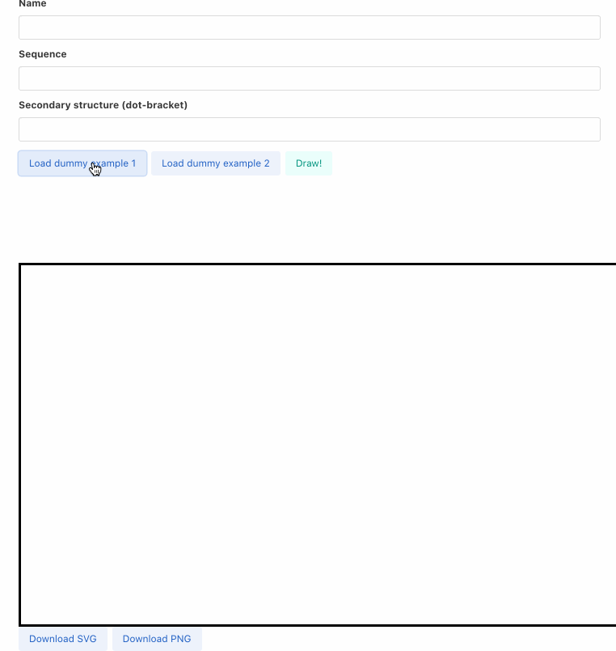
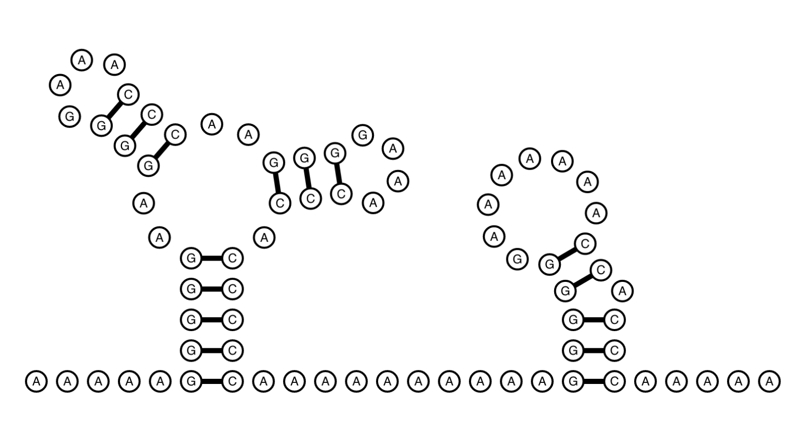

# TS RNA Draw

Ved's attempt at using Typescript to write a pure Javascript RNA secondary structure drawing app. Play around with it here: <a>https://vedtopkar.github.io/ts-rna-draw/</a>

TS RNA Draw can also be used as a CLI utility! See

## Demo



## Use the GUI

Using the following inputs:

```
AAAAAGGGGGAAGGGGAAACCCAAGGGGAAACCCACCCCCAAAAAAAAAAGGGGGGAAAAAAACCACCCAAAAA
.....(((((..(((....)))..(((....))).)))))..........(((((........)).))).....
```

We get:


## Use as CLI utility

You can install this package with npm. First, [install node.js](https://nodejs.org/en/). On MacOS you can just do a quick `brew install  node`.

Once you have node (and thus npm) installed, you can install this package as a global CLI utility by running:

```
npm install -g ts-rna-draw
```

For now, 


## Local Development

Clone:
```
git clone https://github.com/vedtopkar/ts-rna-draw.git
```

Install npm module dependencies:
```
cd ts-rna-draw && yarn install
```

For development, start the `parcel` server with `yarn`:
```
yarn watch
```
Your page will reload every time you hit save on a modified `.ts` or `.html` file.

## Dependencies

- [npm](https://www.npmjs.com/get-npm)
- [yarnjs](https://yarnpkg.com/)
- [parceljs](https://parceljs.org/)

## Feature TODOs

- Implement pan mouse functionality
- Figure out robust vertical text centering for nucleotides
- Implement interactive flipping stems around basline
- ~~Scale up terminal loop radius for large-sequence loops~~
- ~~Abstract away global variables for drawing config~~
- ~~Split up drawing scripts for each element type~~
- ~~Update stem drawing for arbitrary angles~~
- ~~Implement drawing bulges~~
- ~~Implement drawing internal loops~~
- ~~Implement drawing multi-loops~~
- ~~Implement zoom mouse functionality~~
- ~~Implement interactive stem moving at bulges~~
- ~~Implement interactive stem moving at internal loops~~
- ~~Implement interactive stem moving at multi-loops~~